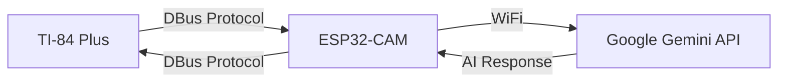

<div align="center">

# 🧮 TI-ESP-GPT

### ESP32-CAM AI Bridge for TI-84 Plus

*Bringing the power of Google Gemini AI to a 20-year-old graphing calculator.*

[](LICENSE)
[](https://github.com/espressif/arduino-esp32)
[](https://education.ti.com/en/products/calculators/graphing-calculators/ti-84-plus)

[Features](#-features) • [Hardware Setup](#-hardware-setup) • [Installation](#-installation) • [Usage](#-usage) • [Troubleshooting](#-troubleshooting)

---

</div>

## 📖 Overview

This project creates a bridge between the **TI-84 Plus** (non-CE) graphing calculator and the modern internet. By connecting the calculator's 2.5mm I/O port to an ESP32-CAM microcontroller, you can send text prompts via the DBus protocol. The ESP32 connects to WiFi, processes these requests, queries the **Google Gemini API**, and sends the AI's response back to your calculator screen.

### 🔄 How It Works



1. **User Input** - Type a question on the calculator using the `PIGPT` program
2. **Transmission** - Calculator sends the string to ESP32-CAM via `Send()` command
3. **Processing** - ESP32 receives the packet and forwards the prompt to Google Gemini via WiFi
4. **Response** - Gemini generates a concise answer
5. **Return** - ESP32 sends the answer back to calculator variable `Str0` via `GetCalc()`

---

## ✨ Features

| Feature | Description |
|---------|-------------|
| 🔌 **Direct Connection** | Uses the calculator's built-in 2.5mm I/O port |
| 🤖 **Google Gemini AI** | Integrates state-of-the-art LLM capabilities |
| 📡 **Full DBus Protocol** | Complete implementation of the TI Link Protocol (bit-banging) |
| ⚡ **Microcontroller Power** | Fast boot time, low power usage, no OS required |
| 📦 **Portable** | Can run off a small battery bank |
| 🛠️ **Built-in Diagnostics** | Serial monitor logging for debugging |
| 🔋 **Power Management** | Automatic deep sleep/wake to extend battery life |
| 🔋 **Power Management** | Automatic deep sleep/wake to extend battery life |
| 🔋 **Power Management** | Automatic deep sleep/wake to extend battery life |

---

## 🛠 Hardware Setup

> [!WARNING]
> **VOLTAGE WARNING**  
> The TI-84 Plus uses 5V logic, while the ESP32-CAM uses 3.3V logic.  
> While many users successfully connect them directly, **series resistors (1kΩ) are highly recommended** to protect your ESP32 from over-current. **Proceed at your own risk.**

### 📦 Required Components

| Component | Qty | Purpose |
|-----------|-----|---------|
| ESP32-CAM | 1 | Main microcontroller (AI Thinker model) |
| FTDI Programmer **OR** Raspberry Pi Pico | 1 | Required to upload code to the ESP32-CAM |
| 2.5mm Stereo Jack | 1 | Male connector (or cut an old aux/link cable) |
| Resistors (Recommended) | 2 | 1kΩ - 2.2kΩ (Protects GPIO) |
| TI-84 Plus | 1 | Non-CE version only (monochrome screen) |
| Micro USB Cable | 1 | For programming the Raspberry Pi Pico (if using Pico method) |

### 🔌 Wiring Guide

The TI-84 Plus uses a 3-wire serial protocol (TIP, RING, GND). We will use GPIO 12 and 13 on the ESP32-CAM.

#### Wiring Table

| ESP32-CAM Pin | Description | Connection Type | Connects to Calculator |
|---------------|-------------|-----------------|------------------------|
| `GND` | Ground | Direct Wire | **Sleeve** (Base of connector) |
| `GPIO 12` | Data 1 | Via 1kΩ Resistor | **TIP** (Tip of connector) |
| `GPIO 13` | Data 2 | Via 1kΩ Resistor | **RING** (Middle ring) |
| `5V / 3.3V` | Power | To Power Source | — |

#### Visual Reference

- **TIP** (Red/White): The very tip of the 2.5mm jack
- **RING** (White/Red): The middle section of the jack
- **GND** (Copper): The base/sleeve of the jack

#### Connection Diagram

```
       ESP32-CAM                    Calculator 2.5mm Jack
    +--------------+                    +---------+
    |              |                    |         |
    |          GND |--------------------| SLEEVE  | (Ground)
    |              |                    |         |
    |              |      1kΩ Res       |         |
    |      GPIO 12 |-----/\/\/\---------| TIP     | (Data 1)
    |              |                    |         |
    |              |      1kΩ Res       |         |
    |      GPIO 13 |-----/\/\/\---------| RING    | (Data 2)
    |              |                    |         |
    +--------------+                    +---------+
```

---

## 💻 Installation

### 1️⃣ Prepare Arduino IDE

1. Install the [Arduino IDE](https://www.arduino.cc/en/software)
2. Add ESP32 support:
   - Go to **File → Preferences**
   - In "Additional Board Manager URLs", add:
     ```
     https://raw.githubusercontent.com/espressif/arduino-esp32/gh-pages/package_esp32_index.json
     ```
   - Go to **Tools → Board → Boards Manager**, search for "esp32", and install
3. Select your board: **Tools → Board → AI Thinker ESP32-CAM**

### 2️⃣ Configure the Firmware

#### 🔑 Initial Configuration (First Time Only)

1. Download this repository and open `esp32/esp32.ino` in Arduino IDE
2. Edit the [`secrets.h`](esp32/secrets.h) file to add your initial credentials:

```cpp
// --- WiFi Settings ---
#define WIFI_SSID "YOUR_WIFI_NAME"     // Your actual WiFi Name
#define WIFI_PASS "YOUR_WIFI_PASSWORD" // Your actual WiFi Password

// --- Server Settings ---
#define SERVER "https://your-ngrok-url.ngrok-free.app"  // Your Ngrok URL

// Login for your node server (matches your .env file)
#define HTTP_USERNAME "your_username"
#define HTTP_PASSWORD "your_password"

// Your Chat Name
#define CHAT_NAME "ai-84"

// --- Secure Mode ---
#define SECURE
```

#### 🔑 Configuration Details

| Parameter | Description | How to Get It |
|-----------|-------------|---------------|
| `WIFI_SSID` | Your WiFi network name | Found in your router settings or WiFi connection list |
| `WIFI_PASS` | Your WiFi password | Found in your router settings (usually on a sticker on the router) |
| `SERVER` | Your Ngrok public URL | Will be obtained after starting Ngrok (see below) |
| `HTTP_USERNAME` | Node.js server username | Set in your server's `.env` file |
| `HTTP_PASSWORD` | Node.js server password | Set in your server's `.env` file |
| `CHAT_NAME` | Your chat identifier | Any name you prefer (e.g., "ai-84") |

**Example Configuration:**
```cpp
#define WIFI_SSID "MyHomeWiFi"
#define WIFI_PASS "MySecurePassword123"
#define SERVER "https://c7532afaf9b0.ngrok-free.app"
#define HTTP_USERNAME "joshipa"
#define HTTP_PASSWORD "Lostking@18"
#define CHAT_NAME "ai-84"
```

> [!TIP]
> **Getting Your Google Gemini API Key:**
> 1. Visit [Google AI Studio](https://aistudio.google.com/app/apikey)
> 2. Sign in with your Google account
> 3. Click "Get API Key" or "Create API Key"
> 4. Copy the generated key (it starts with `AIza`)
> 5. Paste it into your server's `.env` file
>
> The free tier includes generous usage limits suitable for personal projects!

#### 🔐 Calculator Unlock Password

The ESP32 starts in a **locked state** to prevent unauthorized commands from the calculator.

| Parameter | Value | Purpose |
|-----------|-------|---------|
| **Unlock Password** | `42069` | Must be sent to variable `P` on the calculator to unlock ESP32 features |

**How to Unlock:**
1. On your TI-84 Plus, press **[2nd]** → **[0]** (CATALOG)
2. Scroll down to `Send(` and press **[ENTER]**
3. Type: `Send(42069,P)`
4. Press **[ENTER]**

Once unlocked, the ESP32 will accept commands from the `PIGPT` program.

> [!NOTE]
> You only need to unlock once per ESP32 power cycle. If you reset the ESP32, you'll need to send the unlock password again.

### 3️⃣ Start Node.js Server & Ngrok

Before uploading to ESP32, you need to start your backend server and Ngrok tunnel:

#### **Step 1: Start Node.js Server**
```bash
cd server
npm install
npm start
```
- Server listens on `http://localhost:8080`

#### **Step 2: Start Ngrok Tunnel**
```bash
cd server
./ngrok.exe http 8080
```
- Ngrok will create a public HTTPS URL
- Example output: `https://c7532afaf9b0.ngrok-free.app`
- **Copy this URL** - you'll need it for the next step

> [!NOTE]
> Keep both the Node.js server and Ngrok running in the background. The ESP32 will connect to your local server through the Ngrok tunnel.

### 4️⃣ Upload to ESP32-CAM

You have two options for programming the ESP32-CAM:

#### **Option A: Using FTDI Programmer (Traditional Method)**

1. Connect your ESP32-CAM to the FTDI programmer (ensure **GPIO 0 is connected to GND** to enter flash mode)
2. Press the **Reset** button on the ESP32-CAM
3. Click **Upload** in Arduino IDE
4. Once done, **disconnect GPIO 0 from GND** and press **Reset** again to run the code

#### **Option B: Using Raspberry Pi Pico as FTDI (Recommended Alternative)**

The Raspberry Pi Pico can act as a USB-to-serial bridge, eliminating the need for a dedicated FTDI programmer.

##### **Step 1: Program the Raspberry Pi Pico**

1. Download the **Picoprobe** firmware (enables the Pico to act as a programmer):
   - Get it from: [Picoprobe Releases](https://github.com/raspberrypi/picoprobe/releases)
   - Download `picoprobe.uf2`

2. Flash the Pico:
   - Hold the **BOOTSEL** button on the Pico while plugging it into your computer via USB
   - The Pico will appear as a USB mass storage device called **RPI-RP2**
   - Drag and drop `picoprobe.uf2` onto the drive
   - The Pico will reboot automatically and now functions as a USB-to-serial adapter

##### **Step 2: Wire the Pico to ESP32-CAM**

| Raspberry Pi Pico Pin | Connection | ESP32-CAM Pin |
|-----------------------|------------|---------------|
| **GP0** (Pin 1) | TX (Transmit) | **U0R** (RX) |
| **GP1** (Pin 2) | RX (Receive) | **U0T** (TX) |
| **GND** (Pin 3, 8, 13, 18, etc.) | Ground | **GND** |
| **VBUS** (Pin 40) | Power (5V) | **5V** |

**Additional for Flash Mode:**
- Connect **GPIO 0** on ESP32-CAM to **GND** temporarily to enter programming mode
- After uploading, disconnect GPIO 0 from GND

##### **Wiring Diagram: Pico to ESP32-CAM**

```
    Raspberry Pi Pico              ESP32-CAM
   +-----------------+           +--------------+
   |                 |           |              |
   |   GP0 (Pin 1)   |---------->| U0R (RX)     | (TX from Pico)
   |   GP1 (Pin 2)   |<----------| U0T (TX)     | (RX to Pico)
   |   GND (Pin 3)   |-----------| GND          |
   |   VBUS (Pin 40) |-----------| 5V           |
   |                 |           |              |
   +-----------------+           +--------------+
                                         |
                                    GPIO 0 ---[Connect to GND for flashing]
```

##### **Step 3: Upload Code via Pico**

1. In Arduino IDE, go to **Tools → Port** and select the port labeled **Picoprobe** or **USB Serial Device**
2. Ensure **GPIO 0** on the ESP32-CAM is connected to **GND**
3. Press the **Reset** button on the ESP32-CAM (if available)
4. Click **Upload** in Arduino IDE
5. Wait for the upload to complete
6. **Disconnect GPIO 0 from GND**
7. Press **Reset** again (or power cycle) to run your code

> [!TIP]
> **Troubleshooting Pico Programming:**
> - If upload fails, ensure GPIO 0 is grounded before clicking Upload
> - Check that TX/RX pins are not swapped (GP0 → U0R, GP1 → U0T)
> - Try a different USB cable if the Pico is not recognized
> - Some ESP32-CAM boards may require manual reset timing - press reset right as "Connecting..." appears

### 5️⃣ Configure WiFi & Ngrok from Calculator

After uploading the firmware, you can configure WiFi and Ngrok settings directly from your calculator without physical access to the ESP32.

#### **Step 1: Configure WiFi Network**

1. Connect your calculator to ESP32 via serial cable (GPIO 12/13)
2. Run the `WIFISCAN` program on your calculator:
   - Press **[PRGM]**, select `WIFISCAN`, press **[ENTER]**
   - The program will scan for available networks and display them
   - Note the index number of your desired network

3. Run the `WIFIPASS` program:
   - Press **[PRGM]**, select `WIFIPASS`, press **[ENTER]**
   - Enter the SSID (network name) when prompted
   - Enter the WiFi password when prompted
   - The ESP32 will connect and save credentials to NVS (persistent storage)

> [!TIP]
> **Troubleshooting WiFi:**
> - If connection fails, verify the password is correct
> - Check that the network is 2.4GHz (ESP32 doesn't support 5GHz)
> - Ensure the network is within range

#### **Step 2: Configure Ngrok URL**

1. Run the `NGROKSET` program:
   - Press **[PRGM]**, select `NGROKSET`, press **[ENTER]**
   - The program will show the current Ngrok URL
   - Enter your new Ngrok URL (from Step 2 above)
   - The ESP32 will save the URL and use it immediately

> [!NOTE]
> The Ngrok URL is stored in NVS and persists across reboots. You can update it anytime without physical access to the ESP32.

#### **Step 3: Verify Configuration**

1. Run the `PIGPT` program to test the connection:
   - Press **[PRGM]**, select `PIGPT`, press **[ENTER]**
   - Enter a test question (e.g., "What is 2+2?")
   - The ESP32 will connect to your Node.js server via Ngrok and return the AI response

### 4️⃣ Install Calculator Program

You need to get the `PIGPT` program onto your calculator.

<details>
<summary>📝 <b>Click to view PIGPT.txt (TI-BASIC Source)</b></summary>

```
PROGRAM:PIGPT
:ClrHome
:Disp "ESP-GPT V1.0"
:Disp ""
:Input "ASK:",Str1
:ClrHome
:Disp "SENDING..."
:Send(Str1)
:ClrHome
:Disp "THINKING..."
:Disp "(WAIT 10S)"
:GetCalc(Str0)
:ClrHome
:Disp Str0
:Pause 
:ClrHome
:Stop
```

</details>

**Manual Entry:**  
The easiest way without a dedicated link cable is to type this short program manually into the calculator by pressing **[PRGM]**, **[NEW]**.

---

## 🚀 Usage

### Step 1: Verify Connection

1. Open the **Serial Monitor** in Arduino IDE (Set baud rate to **115200**)
2. Reset the ESP32
3. You should see:

```
[Setup] Attempting WiFi connection...
[Setup] Using saved WiFi credentials from NVS
[Setup] WiFi connected! IP: 192.168.1.XXX
[Setup] Starting OTA Web Server...
[OTAManager] Web server started
[OTAManager] Server Port: 80
[OTAManager] Update Endpoint: /update
[OTAManager] Status Endpoint: /status
[OTAManager] Sketch Size: 123456
[OTAManager] Free Space: 456789
[ready]
```

### Step 2: Use the Calculator

1. Plug the 2.5mm jack into the calculator
2. Press **[PRGM]** on the TI-84 Plus
3. Select `PIGPT` and press **[ENTER]**
4. At the `ASK:` prompt, type your question (e.g., `"DEFINE ATOM"`)
5. Press **[ENTER]**

The Serial Monitor will show:

```
Received: "DEFINE ATOM"
Querying Gemini...
Response: "An atom is the smallest unit of matter..."
Sending to Calc... Done.
```

**The answer will appear on your calculator screen!** 🎉

### Step 3: Update Firmware via WiFi (OTA)

After initial setup, you can update the ESP32 firmware without physical access:

1. **Find your ESP32's local IP address:**
   - Check the Serial Monitor for: `IP: 192.168.1.XXX`
   - Or run the `WIFIPASS` program and check the connection status
   - **NEW:** Use the Node.js scripts for easy IP detection (see below)

2. **Open the OTA Update page in your browser:**
   - Navigate to: `http://192.168.1.XXX/update` (replace with your ESP32's IP)
   - You'll see a simple web interface with a file upload form

3. **Upload new firmware:**
   - Click "Choose File" and select your `.bin` firmware file
   - Click "Upload Firmware"
   - Wait for the upload to complete (progress bar will show status)
   - ESP32 will automatically restart with the new firmware

> [!NOTE]
> **Important:** The OTA web server runs on port 80. Make sure your computer is on the same WiFi network as the ESP32.

> [!TIP]
> **Troubleshooting OTA:**
> - If you can't access the OTA page, verify the ESP32 is connected to WiFi
> - Check your firewall settings if the page doesn't load
> - The ESP32 must have enough free flash space for the new firmware

### Step 4: Power Management (NEW)

The ESP32-CAM now features automatic power management to extend battery life when used with the calculator:

#### How It Works
- **When calculator connected**: ESP32 wakes up, connects to WiFi, starts OTA server
- **When calculator disconnected**: ESP32 enters deep sleep after 5 seconds
- **When calculator reconnected**: ESP32 wakes up, reconnects to WiFi, resumes operation

#### Power Consumption
- **Deep Sleep**: ~10µA (months on small LiPo battery)
- **Active (WiFi connected)**: ~100-200mA
- **Active (WiFi idle)**: ~50-100mA

#### Power Status Command
New command ID 21 (`get_power_status`) provides power management status:

```basic
PROGRAM:POWERSTATUS
:ClrHome
:Disp "GETTING POWER STATUS..."
:Send(21)
:GetCalc(Str0)
:Disp Str0  // Shows power state, boot count, WiFi status
:Pause
:ClrHome
:Stop
```

**Output Format:**
```json
{
  "powered": true,
  "deepSleep": false,
  "bootCount": 5,
  "wifiConnected": true,
  "lastIP": "192.168.1.100"
}
```

#### Hardware Requirements
- **No additional hardware needed** - uses existing TIP/RING pins
- **Existing 1kΩ resistors** provide voltage protection
- **Software-only solution** - detects power via existing connections

#### Benefits
- **Extended battery life** when calculator disconnected
- **Automatic operation** - no user intervention needed
- **Fast wake-up** when calculator reconnects (~3-6 seconds)
- **Power status visibility** for debugging

> [!TIP]
> **Pro Tip:** The power management feature is especially useful for portable use. When you disconnect the calculator, the ESP32 automatically enters deep sleep to save battery. When you reconnect, it automatically wakes up and resumes operation.

> [!NOTE]
> **Power Detection:** The ESP32 monitors the TIP/RING pins for voltage presence. When the calculator is connected, these pins receive voltage. When disconnected, the pins go LOW, triggering deep sleep after a 5-second delay.

#### Testing Power Management
1. **Connect calculator** - ESP32 should wake up and connect to WiFi
2. **Disconnect calculator** - ESP32 should enter deep sleep after 5 seconds
3. **Reconnect calculator** - ESP32 should wake up and reconnect to WiFi
4. **Check power status** - Use command 21 to verify power state

> [!WARNING]
> **Important:** The ESP32 must be powered solely by the calculator connection for power management to work correctly. If you have a battery backup, the power management may not function as expected.

#### Power Management Configuration
The power management behavior can be customized in [`esp32/esp32.ino`](esp32/esp32.ino):

```cpp
// Power management configuration
#define POWER_PIN_TIP 12
#define POWER_PIN_RING 13
#define POWER_CHECK_INTERVAL 100  // ms
#define POWER_LOSS_DELAY 5000     // ms (5 seconds delay before deep sleep)
```

You can adjust `POWER_LOSS_DELAY` to change how long the ESP32 waits before entering deep sleep after power loss.

### Step 4: Use Node.js Scripts for WiFi Management (NEW)

The project now includes powerful Node.js scripts for managing WiFi connections and displaying IP addresses from your computer:

#### 📋 Available Scripts

| Script | Purpose | Usage |
|--------|---------|-------|
| **IPADDRESS.mjs** | Get ESP32's current IP address | `node IPADDRESS.mjs [esp32_ip]` |
| **WIFISCAN.mjs** | Scan WiFi networks and show IP | `node WIFISCAN.mjs [esp32_ip]` |
| **WIFIPASS.mjs** | Connect to WiFi and display IP | `node WIFIPASS.mjs [esp32_ip] [ssid] [password]` |
| **NGROKSET.mjs** | Manage Ngrok URL and show IP | `node NGROKSET.mjs [esp32_ip] [new_url]` |

#### 🚀 Quick Start

1. **Install dependencies:**
   ```bash
   npm install node-fetch
   ```

2. **Get ESP32 IP address:**
   ```bash
   node IPADDRESS.mjs 192.168.1.100
   ```

3. **Scan available WiFi networks:**
   ```bash
   node WIFISCAN.mjs 192.168.1.100
   ```

4. **Connect to WiFi network:**
   ```bash
   node WIFIPASS.mjs 192.168.1.100 "MyWiFi" "mypassword"
   ```

5. **Manage Ngrok URL:**
   ```bash
   node NGROKSET.mjs 192.168.1.100 "https://abc123.ngrok-free.app"
   ```

#### 📡 Typical Workflow

```bash
# 1. Connect to ESP32's initial WiFi (if configured)
# 2. Scan available networks
node WIFISCAN.mjs 192.168.1.100

# 3. Connect to your WiFi network
node WIFIPASS.mjs 192.168.1.100 "MyHomeWiFi" "securepassword"

# 4. Set Ngrok URL
node NGROKSET.mjs 192.168.1.100 "https://my-ngrok-url.ngrok-free.app"

# 5. Get current IP for OTA updates
node IPADDRESS.mjs 192.168.1.100

# 6. Open browser to the displayed IP and upload firmware
```

#### 🎯 Benefits

- **Instant IP display** without checking serial monitor
- **Easy WiFi management** from computer without calculator
- **Cross-platform** (works on Windows, macOS, Linux)
- **Clear OTA instructions** with automatic IP detection
- **Backward compatible** with existing calculator programs

> [!TIP]
> **Pro Tip:** Use these scripts when you need to quickly find the ESP32's IP address for OTA updates or when setting up WiFi for the first time. The scripts provide a more convenient alternative to using the calculator programs.

> [!NOTE]
> **Security:** The HTTP endpoints are only accessible on your local network. No authentication is required for local access, but sensitive data (WiFi passwords) are transmitted in plaintext. For production use, consider adding authentication.

#### 🔧 HTTP API Reference

The ESP32 now exposes these HTTP endpoints:

- `GET /wifi/status` - Get WiFi connection status and IP address
- `GET /wifi/scan` - Scan available WiFi networks
- `POST /wifi/connect` - Connect to WiFi network
- `POST /wifi/save` - Save WiFi credentials to NVS
- `GET /ngrok/url` - Get current Ngrok URL
- `POST /ngrok/url` - Set Ngrok URL

These endpoints work alongside the existing calculator-based DBus commands, giving you flexibility in how you manage your ESP32 device.

### Step 4: Update WiFi & Ngrok Settings

You can update WiFi credentials and Ngrok URL anytime from the calculator:

1. **Update WiFi Network:**
   - Run `WIFISCAN` to see available networks
   - Run `WIFIPASS` to connect to a new network
   - Credentials are saved to NVS and persist across reboots

2. **Update Ngrok URL:**
   - Run `NGROKSET` to change the Ngrok URL
   - New URL is used immediately for all API calls
   - No restart required

> [!NOTE]
> **Factory Reset:** If you need to reset all configuration, you can send command `17` with password `42069` to clear NVS and restore default settings from `secrets.h`.

### Step 5: Use Other Features

All existing features continue to work with the new configuration system:

- **GPT Queries:** Use `PIGPT` program as before
- **Image Lists:** Use `image_list` command
- **Program Downloads:** Use `fetch_program` command
- **Chat Features:** Use `send_chat` and `fetch_chats` commands

All API calls now use the Ngrok URL stored in NVS, so you can update it anytime without recompiling.

---

## 🔧 Troubleshooting

| Problem | Likely Cause | Solution |
|---------|--------------|----------|
| `"Error in Xmit"` | Wiring issue | Check resistors and ensure ESP32 is powered on |
| `"Waiting..."` (Forever) | WiFi stuck | Check Serial Monitor to see if WiFi connected successfully |
| Brownout Detector Error | Low Power | ESP32-CAM is power-hungry. Use a better USB cable/power source |
| No Response | API Limit | Check if your Google Gemini API quota is exceeded |
| Gibberish on Calculator | Baud Rate Mismatch | Verify DBus timing in code matches TI protocol specs |
| ESP32 Won't Flash | GPIO 0 Not Grounded | Ensure GPIO 0 is connected to GND during upload |
| Can't Access OTA Page | Wrong IP or Network | Verify ESP32 IP address and that computer is on same network |
| WiFi Won't Connect | Wrong Credentials | Check SSID and password in NVS, try `WIFIPASS` again |
| Ngrok URL Not Working | Invalid Format | URL must contain "ngrok" and be a valid HTTPS URL |

### 🐛 Debug Tips

- Always check the **Serial Monitor** first for detailed logging
- Verify all connections with a multimeter
- Try a different USB cable or power source
- Test the calculator's I/O port with another link cable first
- Use `configMgr.printAll()` in setup to see stored configuration
- Check WiFi status with `wifiMgr.printStatus()`

### 📊 Configuration Status

To view current configuration from Serial Monitor:
```
[ConfigManager] Retrieved SSID: MyHomeWiFi
[ConfigManager] Retrieved WiFi password
[ConfigManager] Retrieved Ngrok URL: https://c7532afaf9b0.ngrok-free.app
[ConfigManager] WiFi connected status: true
[ConfigManager] Boot count: 5
```

---

## 📚 Additional Resources

- [TI-84 Plus Link Protocol Documentation](http://merthsoft.com/linkguide/ti83+/packet.html)
- [ESP32-CAM Pinout Reference](https://randomnerdtutorials.com/esp32-cam-ai-thinker-pinout/)
- [Google Gemini API Documentation](https://ai.google.dev/docs)
- [Ngrok Documentation](https://ngrok.com/docs)
- [Arduino WebServer Library](https://github.com/esp8266/Arduino/tree/master/libraries/ESP8266WebServer)

---

## 📜 License

This project is licensed under the MIT License - see the [LICENSE](LICENSE) file for details.

---

<div align="center">

**Made with ❤️ for the TI Calculator Community**

⭐ Star this repo if you found it helpful!

</div>

| Problem | Likely Cause | Solution |
|---------|--------------|----------|
| `"Error in Xmit"` | Wiring issue | Check resistors and ensure ESP32 is powered on |
| `"Waiting..."` (Forever) | WiFi stuck | Check Serial Monitor to see if WiFi connected successfully |
| Brownout Detector Error | Low Power | ESP32-CAM is power-hungry. Use a better USB cable/power source |
| No Response | API Limit | Check if your Google Gemini API quota is exceeded |
| Gibberish on Calculator | Baud Rate Mismatch | Verify DBus timing in code matches TI protocol specs |
| ESP32 Won't Flash | GPIO 0 Not Grounded | Ensure GPIO 0 is connected to GND during upload |

### 🐛 Debug Tips

- Always check the **Serial Monitor** first for detailed logging
- Verify all connections with a multimeter
- Try a different USB cable or power source
- Test the calculator's I/O port with another link cable first

---

## 📚 Additional Resources

- [TI-84 Plus Link Protocol Documentation](http://merthsoft.com/linkguide/ti83+/packet.html)
- [ESP32-CAM Pinout Reference](https://randomnerdtutorials.com/esp32-cam-ai-thinker-pinout/)
- [Google Gemini API Documentation](https://ai.google.dev/docs)

---

## 📜 License

This project is licensed under the MIT License - see the [LICENSE](LICENSE) file for details.

---

<div align="center">

**Made with ❤️ for the TI Calculator Community**

⭐ Star this repo if you found it helpful!

</div>