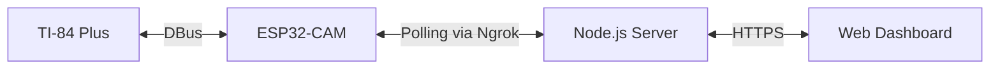

<div align="center">

# 🧮 TI-32 (v0.2) - Mailbox Edition

### ESP32-CAM AI Bridge for TI-84 Plus

*Bringing the power of modern AI to a 20-year-old graphing calculator, now with World-Wide access.*

[](LICENSE)
[](https://github.com/espressif/arduino-esp32)
[](https://education.ti.com/en/products/calculators/graphing-calculators/ti-84-plus)

[Features](#-features) • [Hardware Setup](#-hardware-setup) • [Installation](#-installation) • [Dashboard](#-device-dashboard) • [Reorganization](#-project-structure)

---

</div>

## 📖 Overview

The **TI-32** project connects your **TI-84 Plus** graphing calculator to the internet. This version (v0.2) introduces a **Mailbox/Polling architecture**, allowing the Server and ESP32 to communicate even if they are on completely different Wi-Fi networks. You can now control and monitor your calculator bridge from anywhere in the world via a web-based dashboard.

### 🔄 New Mailbox Architecture



1. **Polling** - The ESP32 checks the server every 5 seconds for pending commands.
2. **Mailbox** - The server queues commands (like WiFi scans) and holds them until the ESP32 fetches them.
3. **Execution** - The ESP32 executes the command and POSTs the result back to the server.
4. **Visibility** - The Web Dashboard shows real-time device logs and status.

---

## ✨ Features

| Feature | Description |
|---------|-------------|
| 🌐 **Mailbox Logic** | Robust communication across different networks and firewalls. |
| 📊 **Device Dashboard** | Chat-style UI for real-time logging and control. |
| 📡 **Remote WiFi Scan** | Scan for networks around the ESP32 from your browser. |
| 🤖 **AI Integration** | Query ChatGPT/Gemini directly from your calculator. |
| 📷 **Remote Camera** | Trigger camera captures and view results remotely. |
| 📂 **Smart Organization** | Clean project structure with dedicated `cli/`, `build/`, and `docs/` folders. |

---

## 🖥 Device Dashboard (NEW)

The new web interface allows you to monitor and control your ESP32-CAM without needing a serial cable.

### Accessing the Dashboard
1. Start your server: `npm start`
2. Start Ngrok: `./ngrok.exe http 8080`
3. Navigate to: `http://localhost:8080/esp32.html` (or your public Ngrok URL)

### Dashboard Features
- **Device Logs**: Real-time view of what the ESP32 is doing (e.g., `[10:05] Scanning networks...`).
- **WiFi Controls**: Trigger a detailed WiFi scan remotely.
- **Status Check**: View Uptime, Free Heap, Boot Count, and Signal Strength.
- **Ngrok Update**: Remotely update the Ngrok URL the device should point to.

---

## 📂 Project Structure

The project has been reorganized for better maintainability:

- **`cli/`**: Command-line utility scripts (`WIFISCAN.mjs`, `NGROKSET.mjs`, etc.)
- **`build/`**: Build and preparation scripts (`genfiles.sh`, `prepareimage.mjs`, etc.)
- **`docs/`**: Documentation, plans, and implementation details.
- **`server/`**: The Node.js backend logic.
- **`esp32/`**: ESP32-CAM firmware source code.
- **`programs/`**: TI-BASIC programs for the calculator.
- **`tests/`**: Automated test scripts.

---

## 💻 Installation & Setup

### 1️⃣ Firmware Configuration
Update your [`esp32/secrets.h`](esp32/secrets.h) with your initial credentials. The ESP32 will now use the `currentServer` variable to poll the server.

### 2️⃣ Server Setup
```bash
cd server
npm install
npm start
```

### 3️⃣ Usage via CLI
You can still use the CLI tools now located in the `cli/` folder:
```bash
npm run scan      # node cli/WIFISCAN.mjs
npm run ngrok     # node cli/NGROKSET.mjs
```

---

## 🚀 Calculator Commands

The ESP32 supports the following Command IDs sent via `Send(ID,C)`:

| ID | Name | Description |
|----|------|-------------|
| 15 | `scan_networks` | Returns a list of available WiFi networks. |
| 20 | `get_ip_address`| Returns the ESP32's local IP address. |
| 21 | `get_power_status`| Returns JSON power/boot status. |
| 22 | `get_status` | Returns comprehensive device status (Uptime, Heap, etc.) |

> **Note**: Polling is automatically suspended while the ESP32 is busy communicating with the calculator to ensure timing accuracy.

---

## 🛠 Troubleshooting

- **Polling Lag**: The default polling interval is 5 seconds. Commands sent from the Dashboard may take a few seconds to trigger.
- **Ngrok Tunnel**: Ensure your Ngrok tunnel is active. If the URL changes, you'll need to update it via the Dashboard or the `NGROKSET` calculator program.
- **Busy State**: If the ESP32 is currently running a calculator command, it will wait until completion before polling the server again.

---

<div align="center">
**Made with ❤️ for the TI Calculator Community**
</div>
